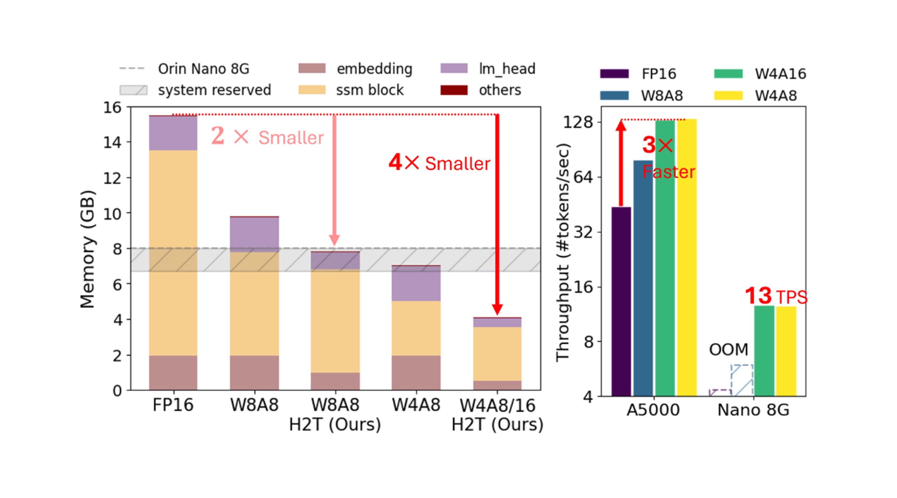

# Quamba

[Hung-Yueh Chiang](https://hychiang.info/),
[Chi-Chih Chang](https://ccchang.info/),
[Natalia Frumkin](https://www.nfrumkin.com),

[Kai-Chiang Wu](https://people.cs.nycu.edu.tw/~kcw/),
[Mohamed S. Abdelfattah](https://www.mohsaied.com/),
[Diana Marculescu](https://users.ece.utexas.edu/~dianam/)

[](https://arxiv.org/pdf/2503.22879)
[](https://hychiang.info/projects/quamba2/)


- 🔧 Supports W4A8 / W4A16 / W4AX / W8A8 for Mamba1 and Mamba2
- 🔻 4× memory reduction
- 🚀 Achieves 13 tokens per second on Orin Nano 8G with Mamba2-8B




## Real-time Generation on a NVIDIA Orin Nano 8G


## Setup

### Hardware Requirements
- NVIDIA GPU Ampere architecture or above

### Software Requirements
- CUDA 12.1 or above
- CMAKE version 3.22.1 or above

### Clone Quamba
- Clone the repository with all submodules:
```
git clone --recurse-submodules git@github.com:enyac-group/Quamba.git
# or
cd Quamba
git submodule update --init --recursive
```

- Run in docker (optional)

To build the docker image with customized kernels, run the following commands:
```
cd docker
./build_docker.sh
./run.sh # launch the container
```

Or Pull the pre-built docker image by
```
docker image pull hychiang/quamba-cuda-12.1:latest
```

- Create Quamba conda environment
```
cd Quamba
conda create -n quamba python=3.10
conda activate quamba
pip install -r requirements.txt
```

### Build 3rd-party Libraries

- Install `fast-hadamard-transform`:
```
# set force build to include 12N, 40N from the newer commit
export FAST_HADAMARD_TRANSFORM_FORCE_BUILD=TRUE
pip install 3rdparty/fast-hadamard-transform
```

- Install `lm-evaluation-harness`:
```
# lm_eval-0.4.2 word2number-1.1
pip install 3rdparty/lm-evaluation-harness
``````

- Install mamba
```
# set force build to use the commit for Quamba
export MAMBA_FORCE_BUILD=TRUE
pip install 3rdparty/mamba
```

- Install CUTLASS
```
# cmake version >= 3.22.1
bash build_cutlass.sh
```

- Install Megatron-LM
```
pip install -e 3rdparty/Megatron-LM
# Not sure why Megatron-LM will force to install pytorch 2.6.0+cu124
# , so run `pip install -r requirements.txt` again if necessary
```

### Build Quamba
```
pip install .
```

## Generate

To generate the sentence from Mamba (FP16) given an input prompt:
```
python generate.py state-spaces/mamba2-130m --prompt "My cat wrote all this CUDA code for a new language model and" --topp 0.9 --temperature 0.7 --repetition_penalty 1.2
```

To generate the sentence from Quamba (Int8) given an input prompt:
```
python generate.py state-spaces/mamba2-130m --prompt "My cat wrote all this CUDA code for a new language model and" --topp 0.9 --temperature 0.7 --repetition_penalty 1.2 --quantize --cache_graph
```

##  Quantization Evaluation
To evaluate the end-to-end quantization:
```
python main.py state-spaces/mamba-130m real \
--act_scales_cache mamba-130m_scales.pt \
--batch_size 1 \
--task_list lambada_openai \
--eval_zero_shot \
--log_dir logs
```

# Chat

To chat with the fp16 model, use the command:
```
# FP16
python chat.py --cache_graph
```

To chat with the int8 model, use the command:
```
# W8A8 (default)
python chat.py --cache_graph --quantize --quantize_embedding --quantize_lm_head
# W4A8
python chat.py --cache_graph --quantize --w_bits 4 --a_bits 8 --apply_gptq --quantize_embedding --quantize_lm_head
# W4A16
python chat.py --cache_graph --quantize --w_bits 4 --a_bits 16 --apply_gptq --quantize_embedding --quantize_lm_head
```


## Profile latency and memory

- To profile time-to-first-token (prefilling stage):
```
python profile_mamba.py state-spaces/mamba-2.8b  --act_scales_cache mamba-2.8b_scales.pt --prompt_len 512 --ttft
```

- To profile time-per-output-token (generation stage):
```
python profile_mamba.py state-spaces/mamba-2.8b  --act_scales_cache mamba-2.8b_scales.pt --tpot
```

- To profile time-to-last-token (prefilling + generation stage):
```
python profile_mamba.py state-spaces/mamba-2.8b  --act_scales_cache mamba-2.8b_scales.pt --prompt_len 512 --gen_len 512 --ttlt
```

- To profile memory usage (prefilling + generation stage):
```
python profile_mamba.py state-spaces/mamba-2.8b  --act_scales_cache mamba-2.8b_scales.pt --prompt_len 512 --gen_len 512 --size
```


# Mamba2-8B

Download the checkpoint using `huggingface-cli`
```
huggingface-cli download nvidia/mamba2-8b-3t-4k --local-dir ./pretrained_models/mamba2-8b-3t-4k
```
After downloading, you will have the directory `./pretrained_models/mamba2-8b-3t-4k` having a structure like this
```
├── latest_checkpointed_iteration.txt
├── mt_nlg_plus_multilingual_ja_zh_the_stack_frac_015_256k.model (This is tokenizer)
├── README.md
└── release
    └── mp_rank_00
        └── model_optim_rng.pt (This is weights)
```
+ Run the conversion scripts to get the model directory
```
python convert_mamba2_8b_to_hf.py \
./pretrained_models/mamba2-8b-3t-4k/release/mp_rank_00/model_optim_rng.pt \
./pretrained_models/mamba2-8b-3t-4k/mt_nlg_plus_multilingual_ja_zh_the_stack_frac_015_256k.model \
--model_save_path ./pretrained_models/mamba2-8b-converted
```

After running, you will see a directory called `mamba2-8b-converted` has been created. Then you can run it with evaluation, profiling as the instructions above. However, it requires at least *24GB* memory on the GPU to quantize the Mamba2-8B model.

For example:
```
python main.py pretrained_models/mamba2-8b-converted real \
--batch_size 16 \
--eval_zero_shot \
--task_list lambada_openai \
--q_configs ./configs/mamba2/w4a8/quamba_in_hsort_gptq.json \
--do_reordering \
--group_heads \
--apply_gptq \
--quantize_embedding \
--quantize_lm_head \
--w_bits 4 \
--a_bits 8
``` 

Calibrating scaling factors and applying GPTQ can take lots of time, and quantizing models consumes more memory than running the quantized models. 

To avoid re-calculating scaling factors and GPTQ, use `--pretrained_dir ./pretrained_models` to store the quantized model. The checkpoint under `--pretrained_dir ./pretrained_models/ut-enyac/mamba2-8b-converted-w4a8`. 

For example:

```
python main.py pretrained_models/mamba2-8b-converted real \
--batch_size 16 \
--eval_zero_shot \
--task_list lambada_openai \
--q_configs ./configs/mamba2/w4a8/quamba_in_hsort_gptq.json \
--do_reordering \
--group_heads \
--apply_gptq \
--quantize_embedding \
--quantize_lm_head \
--w_bits 4 \
--a_bits 8 \
--pretrained_dir ./pretrained_models \
--log_dir logs
```

To run with the stored quantized model:

```
python main.py pretrained_models/mamba2-8b-converted real \
--batch_size 16 \
--eval_zero_shot \
--task_list lambada_openai \
--q_configs ./configs/mamba2/w4a8/quamba_in_hsort_gptq.json \
--w_bits 4 \
--a_bits 8 \
--pretrained_dir ./pretrained_models \
--log_dir logs
# or
python main.py ut-enyac/quamba2-8b-converted-w4a8 real \
--batch_size 16 \
--eval_zero_shot \
--task_list lambada_openai \
--q_configs ./configs/mamba2/w4a8/quamba_in_hsort_gptq.json \
--pretrained_dir ./pretrained_models \
--log_dir logs
```

# Citation
```
@article{chiang2025quamba2,
  title={Quamba2: A Robust and Scalable Post-training Quantization Framework for Selective State Space Models},
  author={Chiang, Hung-Yueh and Chang, Chi-Chih and Frumkin, Natalia and Wu, Kai-Chiang, Abdelfattah, Mohamed S.  and Marculescu, Diana},
  journal={arXiv preprint arXiv:2503.22879},
  year={2025}
}
@article{chiang2024quamba,
  title={Quamba: A Post-Training Quantization Recipe for Selective State Space Models},
  author={Chiang, Hung-Yueh and Chang, Chi-Chih and Frumkin, Natalia and Wu, Kai-Chiang and Marculescu, Diana},
  journal={arXiv preprint arXiv:2410.13229},
  year={2024}
}
````
