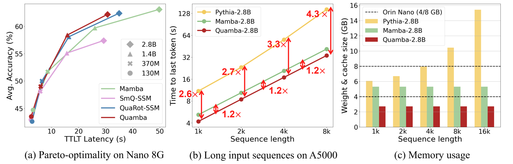

# Quamba: Post-training Quantization for Selective State Space Models



⚡8-bit quantization (W8A8) for mamba blocks 🚀1.7 $\times$ speedup on Orin Nano 8G 🔻 2 $\times$ memory reduction


## Real-time Generation on a NVIDIA Orin Nano 8G


## Setup

### Hardware Requirements
- NVIDIA GPU Ampere architecture or above

### Software Requirements
- CUDA 12.1 or above
- CMAKE version 3.22.1 or above

### Clone Quamba
- To clone the repository with all submodules:
```
git clone --recurse-submodules git@github.com:enyac-group/Quamba.git
```

- Run in docker (optional)
As our implementation entails customized CUDA kernels and depends on specific CUDA version, user may optionally run our code in docker. To build the docker image, run the following command:
```
cd docker
./build_docker.sh
```

After building the docker image, user can run the docker container with the following command:
```
./run.sh
```

Or you could pull the pre-built docker image by
```
docker image pull hychiang/quamba-cuda-12.1:latest
```

- Create conda environment
```
cd Quamba
conda create -n quamba python=3.10
conda activate quamba
pip install -r requirements.txt
```

### Build 3rd-party Libraries

- Install `fast-hadamard-transform`:
```
# set force build to include 12N, 40N from the newer commit
export FAST_HADAMARD_TRANSFORM_FORCE_BUILD=TRUE
pip install 3rdparty/fast-hadamard-transform
```

- Install `lm-evaluation-harness`:
```
# lm_eval-0.4.2 word2number-1.1
pip install 3rdparty/lm-evaluation-harness
``````

- Install mamba
```
# set force build to use the commit for Quamba
export MAMBA_FORCE_BUILD=TRUE
pip install 3rdparty/mamba
```

- Install CUTLASS
```
# cmake version >= 3.22.1
bash build_cutlass.sh
```

### Build Quamba
```
pip install .
```

## Generate

To generate the sentence from a FP16 mamba model with a input prompt:
```
python generate.py state-spaces/mamba-130m --prompt "My cat wrote all this CUDA code for a new language model and" --topp 0.9 --temperature 0.7 --repetition_penalty 1.2
```

To generate the sentence from a Int8 mamba model with a input prompt:
```
python generate.py state-spaces/mamba-130m --prompt "My cat wrote all this CUDA code for a new language model and" --topp 0.9 --temperature 0.7 --repetition_penalty 1.2 --quantize --act_scales_cache mamba-130m_scales.pt
```


## Chat

To chat with the fp16 model, use the command:
```
python chat.py  --cache_graph
```

To chat with the int8 model, use the command:
```
python chat.py  --cache_graph --act_scales_cache mamba-2.8b_scales_chat.pt  --quantize
```

## Profile latency and memory

- To profile time-to-first-token (prefilling stage):
```
python profile_mamba.py state-spaces/mamba-2.8b  --act_scales_cache mamba-2.8b_scales.pt --prompt_len 512 --ttft
```

- To profile time-per-output-token (generation stage):
```
python profile_mamba.py state-spaces/mamba-2.8b  --act_scales_cache mamba-2.8b_scales.pt --tpot
```

- To profile time-to-last-token (prefilling + generation stage):
```
python profile_mamba.py state-spaces/mamba-2.8b  --act_scales_cache mamba-2.8b_scales.pt --prompt_len 512 --gen_len 512 --ttlt
```

- To profile memory usage (prefilling + generation stage):
```
python profile_mamba.py state-spaces/mamba-2.8b  --act_scales_cache mamba-2.8b_scales.pt --prompt_len 512 --gen_len 512 --size
```

## Fake Quantization Evaluation
We support fake quantization simulation for mamba models. To evaluate the performance of the quantized model using fake quantization on lambada_openai (--eval_zero_shot) , you can run the following command:
+ Static quantization, only u_quant and ssm_out are dynamic quantization:
```
python main.py state-spaces/mamba-130m fake \
--batch_size 16 \
--task_list lambada_openai \
--q_configs ./configs/mamba/all_static/had/percentile/had_all_static_u_percentile.json \
--do_calibrate \
--eval_zero_shot \
--log_dir logs
```
User can specify the corresponding quantization setting following the files inside `configs` folder.


## Real Quantization Evaluation
Real quantization only supports `static` quantization, percentile u tensor, and hadamard transform at ssm out with `batch_size = 1`. To evaluate the performance of the quantized model using real quantization on lambada_openai (--eval_zero_shot), you can run the following command:
+ Static quantization, percentile u_quant and hadamard transform ssm_out:
```
python main.py state-spaces/mamba-130m real \
--act_scales_cache mamba-130m_scales.pt \
--batch_size 1 \
--task_list lambada_openai \
--do_calibrate \
--eval_zero_shot \
--log_dir logs
```
